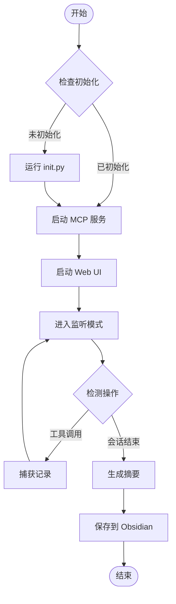

# 🧠 Kimi-Mem

> **为 Kimi Code CLI 打造的持久化记忆系统**  
> 突破上下文限制，让 AI 记住你们的一切对话

<p align="center">
  
  
  
  
  
</p>

<p align="center">
  <a href="#-功能亮点">✨ 功能</a> •
  <a href="#-快速开始">🚀 快速开始</a> •
  <a href="#-使用指南">📖 使用指南</a> •
  <a href="#-配置说明">⚙️ 配置</a> •
  <a href="#-常见问题">❓ FAQ</a>
</p>

---

## ✨ 功能亮点

| 功能 | 描述 | 状态 |
|:---:|:---|:---:|
| 📝 **自动捕获** | 自动记录所有工具调用、文件操作、Shell 命令 | ✅ |
| 💾 **双模式存储** | SQLite 结构化存储 + Markdown 可读文档 | ✅ |
| 🔗 **Obsidian 集成** | 通过 MCP 直接同步到 Obsidian Vault | ✅ |
| 🔍 **智能搜索** | 全文搜索 + 渐进式披露，节省 10 倍 Token | ✅ |
| 🌐 **Web UI** | 美观的暗色主题界面，实时查看记忆 | ✅ |
| 🎭 **Flow 工作流** | 自动执行，无需手动干预 | ✅ |
| 🔒 **隐私保护** | `<private>` 标签排除敏感内容 | ✅ |

---

## 🚀 快速开始

### 第 1 步：安装 Skill

```bash
# 方式 1：直接克隆到 skills 目录（推荐）
git clone https://github.com/yourusername/kimi-mem.git ~/.config/agents/skills/kimi-mem

# 方式 2：解压 .skill 文件
unzip kimi-mem.skill -d ~/.config/agents/skills/
```

### 第 2 步：初始化系统

```bash
# 运行初始化脚本
python ~/.config/agents/skills/kimi-mem/scripts/init.py
```

你会看到类似输出：

```
[OK] 创建目录: /home/user/.kimi/kimi-mem
[OK] 创建配置: /home/user/.kimi/kimi-mem/config.json
[*] 初始化数据库...
[OK] 数据库已就绪
   - 总会话: 0
   - 观察记录: 0
   - 手动记忆: 0
[*] 检查 Obsidian MCP...
[OK] Obsidian MCP 已配置
[OK] 创建 Vault: /home/user/kimi-mem-vault

Kimi-Mem 初始化完成!
```

### 第 3 步：启动使用

在 Kimi Code CLI 中输入：

```
/flow:kimi-mem
```

🎉 **搞定！** Kimi-Mem 现在会自动捕获你的所有操作。

---

## 📖 使用指南

### 🎬 自动捕获

一旦激活，Kimi-Mem 会自动记录：

| 操作类型 | 记录内容 | 示例 |
|:---:|:---|:---|
| 💻 **Shell 命令** | 命令 + 输出 | `pip install requests` |
| 📄 **文件操作** | 读取/修改的文件内容 | `src/main.py` 的修改 |
| 🔧 **工具调用** | 工具名 + 输入 + 输出 | `ReadFile`, `Grep`, `StrReplaceFile` |
| 💬 **对话内容** | 用户输入 + AI 回复 | 问题描述和解决方案 |

> 💡 **提示**：所有记录默认保存在 `~/.kimi/kimi-mem/memory.db` 和 `~/kimi-mem-vault/`

---

### 💾 手动保存记忆

对于特别重要的信息，使用手动保存：

#### 方式 1：斜杠命令

```
/mem:save 用户要求使用 Python 3.14+ 和 uv 管理依赖
```

#### 方式 2：CLI 工具

```bash
python ~/.config/agents/skills/kimi-mem/scripts/cli.py save \
  "Python 项目规范" \
  "使用 uv 进行依赖管理，ruff 进行代码格式化" \
  --tags python,uv,ruff \
  --category learning
```

#### 方式 3：Python API

```python
from storage import get_manager, Memory
from datetime import datetime
import uuid

manager = get_manager()

memory = Memory(
    session_id=str(uuid.uuid4()),
    timestamp=datetime.now().isoformat(),
    title="项目重要决策",
    content="决定使用 FastAPI 而非 Flask",
    tags=["decision", "fastapi"],
    category="decision"
)

memory_id = manager.save_memory(memory)
print(f"✅ 记忆已保存 (ID: {memory_id})")
```

---

### 🔍 搜索记忆

#### 基础搜索

```bash
# 搜索关键词
python ~/.config/agents/skills/kimi-mem/scripts/cli.py search "权限错误"

# 指定类型
python ~/.config/agents/skills/kimi-mem/scripts/cli.py search "认证" --type memories

# 限制结果数量
python ~/.config/agents/skills/kimi-mem/scripts/cli.py search "Python" --limit 5
```

#### MCP 工具搜索（推荐）

在 Kimi 对话中，使用渐进式披露：

```python
# Step 1: 获取索引（低成本）
mem_search(query="数据库连接错误", limit=10)

# Step 2: 查看时间线上下文
mem_timeline(observation_id=123, window_minutes=10)

# Step 3: 获取完整详情（仅筛选后）
mem_get(ids=[123, 124, 125])
```

| 工具 | 用途 | Token 成本 |
|:---:|:---|:---:|
| `mem_search` | 搜索索引 | ~50 /结果 |
| `mem_timeline` | 时间线上下文 | ~100 |
| `mem_get` | 完整详情 | ~500-1000 /条 |
| `mem_save` | 保存记忆 | ~50 |
| `mem_stats` | 统计信息 | ~20 |

> ⚡ **最佳实践**：始终先用 `mem_search` 筛选，再用 `mem_get` 获取详情，可节省 **10 倍 Token**！

---

### 🌐 Web UI 界面

启动 Web 界面实时查看记忆：

```bash
# 基础启动
python ~/.config/agents/skills/kimi-mem/scripts/web_server.py

# 自动打开浏览器
python ~/.config/agents/skills/kimi-mem/scripts/web_server.py --open

# 指定端口
python ~/.config/agents/skills/kimi-mem/scripts/web_server.py --port 38888
```

访问 http://localhost:37777 查看：

- 📊 **统计面板**：总会话、观察记录、手动记忆
- 🔍 **实时搜索**：支持自然语言查询
- 📋 **记录列表**：按类型筛选，点击看详情
- 🕐 **时间线**：查看操作先后顺序

---

### 🎭 使用 Flow Skill

```
/flow:kimi-mem
```

Flow 会自动执行：



---

## 🔗 Obsidian 集成

### 配置步骤

#### 1️⃣ 安装 Obsidian MCP

```bash
kimi mcp add --transport stdio obsidian -- npx -y obsidian-mcp@latest
```

#### 2️⃣ 配置 Vault 路径

```bash
python ~/.config/agents/skills/kimi-mem/scripts/config.py obsidian "/path/to/Obsidian Vault"
```

或使用交互式配置：

```bash
python ~/.config/agents/skills/kimi-mem/scripts/config.py
```

#### 3️⃣ 验证集成

```bash
kimi mcp test obsidian
```

### Obsidian Vault 结构

```
你的 Obsidian Vault/
├── 📁 kimi-mem/
│   ├── 📁 sessions/           # 自动生成的会话记录
│   │   └── 📁 2025/
│   │       └── 📁 02/
│   │           └── 📄 21-session-abc123.md
│   ├── 📁 memories/           # 手动保存的记忆
│   │   ├── 📁 general/
│   │   ├── 📁 bugfix/
│   │   ├── 📁 feature/
│   │   ├── 📁 decision/
│   │   └── 📁 learning/
│   └── 📄 index.md            # 自动生成的索引
└── ... 你的其他笔记
```

### 在 Obsidian 中使用

- 🔗 **双向链接**：记忆会自动添加 `[[...]]` 链接
- 📊 **Dataview 查询**：使用 Dataview 插件筛选记忆
- 🕸️ **图谱视图**：在 Graph View 中查看知识关联
- 🔍 **快速搜索**：使用 Obsidian 的全文搜索

---

## ⚙️ 配置说明

### 配置文件位置

```
~/.kimi/kimi-mem/config.json
```

### 完整配置示例

```json
{
  "storage": {
    "mode": "both",
    "sqlite_path": "~/.kimi/kimi-mem/memory.db",
    "markdown_path": "~/kimi-mem-vault",
    "obsidian_vault": "~/Documents/Obsidian Vault"
  },
  "capture": {
    "auto_capture": true,
    "capture_tool_output": true,
    "max_output_length": 10000,
    "exclude_patterns": [
      "*.log",
      "node_modules/**",
      ".git/**",
      "__pycache__/**"
    ]
  },
  "search": {
    "default_limit": 10,
    "enable_semantic": false,
    "embedding_model": "text-embedding-3-small"
  },
  "web_ui": {
    "enabled": true,
    "port": 37777,
    "auto_open": false
  },
  "mcp": {
    "enabled": true,
    "obsidian_integration": true
  }
}
```

### 配置项说明

| 配置项 | 类型 | 默认值 | 说明 |
|:---|:---:|:---:|:---|
| `storage.mode` | string | `"both"` | 存储模式：`sqlite` / `markdown` / `both` |
| `storage.sqlite_path` | string | `"~/.kimi/kimi-mem/memory.db"` | SQLite 数据库路径 |
| `storage.markdown_path` | string | `"~/kimi-mem-vault"` | Markdown 存储路径 |
| `storage.obsidian_vault` | string | `null` | Obsidian Vault 路径 |
| `capture.auto_capture` | boolean | `true` | 是否自动捕获 |
| `capture.max_output_length` | integer | `10000` | 输出内容最大长度 |
| `capture.exclude_patterns` | array | `["*.log", ...]` | 排除的文件模式 |
| `web_ui.port` | integer | `37777` | Web UI 端口号 |

---

## 🛠️ CLI 命令参考

```bash
# 初始化
kimi-mem init

# 保存记忆
kimi-mem save "标题" "内容" [--tags a,b] [--category general]

# 搜索
kimi-mem search "查询" [--type all|observations|memories] [--limit 10]

# 统计
kimi-mem stats

# 启动 Web UI
kimi-mem web [--port 37777] [--open]

# 配置管理
kimi-mem config obsidian "/path/to/vault"
kimi-mem config mode both
kimi-mem config web --enable --port 37777
kimi-mem config show
```

---

## 🔒 隐私控制

### 排除敏感内容

使用 `<private>` 标签：

```
<private>
这是我的 API 密钥: sk-xxxxxxxxx
这是我的密码: ********
</private>
```

被标记的内容不会被记录。

### 临时禁用捕获

```
/mem:nosave 这条消息不要记录
```

### 排除文件模式

在配置中添加排除规则：

```json
{
  "capture": {
    "exclude_patterns": [
      "*.log",
      "node_modules/**",
      ".env*",
      "*.secret"
    ]
  }
}
```

---

## ❓ 常见问题

### Q: 如何检查 Kimi-Mem 是否正常工作？

```bash
# 查看统计信息
python ~/.config/agents/skills/kimi-mem/scripts/cli.py stats
```

如果看到统计数字（非全 0），说明正在工作。

### Q: 如何查看已保存的记忆？

**方式 1**：启动 Web UI
```bash
python ~/.config/agents/skills/kimi-mem/scripts/web_server.py --open
```

**方式 2**：直接查看 Markdown
```bash
ls ~/kimi-mem-vault/sessions/
cat ~/kimi-mem-vault/index.md
```

**方式 3**：使用 SQLite 浏览器打开 `~/.kimi/kimi-mem/memory.db`

### Q: Obsidian 同步失败怎么办？

1. 检查 MCP 状态：
   ```bash
   kimi mcp list
   ```

2. 验证 Vault 路径：
   ```bash
   python ~/.config/agents/skills/kimi-mem/scripts/config.py show
   ```

3. 测试 Obsidian MCP：
   ```bash
   kimi mcp test obsidian
   ```

4. 重新安装 Obsidian MCP：
   ```bash
   kimi mcp remove obsidian
   kimi mcp add --transport stdio obsidian -- npx -y obsidian-mcp@latest
   ```

### Q: 如何导出所有记忆？

```bash
# 导出为 SQL
sqlite3 ~/.kimi/kimi-mem/memory.db .dump > backup.sql

# 导出 Markdown（直接复制 vault 目录）
cp -r ~/kimi-mem-vault ./backup/
```

### Q: 数据库太大怎么办？

```bash
# 压缩数据库
sqlite3 ~/.kimi/kimi-mem/memory.db "VACUUM;"

# 或者删除旧记录（谨慎操作）
sqlite3 ~/.kimi/kimi-mem/memory.db "DELETE FROM observations WHERE timestamp < date('now', '-30 days');"
```

### Q: 支持多设备同步吗？

目前需要手动同步：

1. 使用云盘（Dropbox/Google Drive）同步 `~/.kimi/kimi-mem/`
2. 或使用 Git 管理 `~/kimi-mem-vault/`

未来版本将支持自动云同步。

---

## 🤝 贡献指南

欢迎提交 Issue 和 PR！

```bash
# 克隆仓库
git clone https://github.com/yourusername/kimi-mem.git
cd kimi-mem

# 创建分支
git checkout -b feature/your-feature

# 提交更改
git commit -m "✨ Add new feature"

# 推送
git push origin feature/your-feature
```

---

## 📜 许可证

MIT License © 2025 Kimi-Mem Contributors

---

<p align="center">
  Made with ❤️ by <a href="https://github.com/yourusername">Your Name</a>
</p>

<p align="center">
  <a href="#-kimi-mem">⬆️ 回到顶部</a>
</p>
