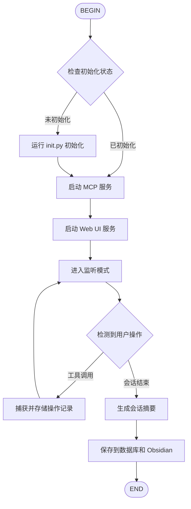

# Kimi-Mem 持久化记忆系统

Kimi-Mem 是一个为 Kimi Code CLI 设计的持久化记忆系统，自动捕获所有用户操作、对话内容和工具使用记录，突破上下文限制，实现跨会话的知识积累与检索。

## 核心功能

- **自动捕获**：记录所有工具调用、文件操作、Shell 命令执行结果
- **手动记忆**：通过 `/mem:save` 保存重要洞察
- **双模式存储**：SQLite（结构化查询）+ Markdown（可读性）
- **Obsidian 集成**：通过 MCP 直接存储到 Obsidian Vault
- **语义搜索**：基于向量数据库的智能检索
- **Web UI**：实时查看和管理记忆（http://localhost:37777）

## 快速开始

### 初始化记忆系统

```bash
# 首次使用，初始化数据库和配置
python ~/.config/agents/skills/kimi-mem/scripts/init.py
```

### 自动捕获

Kimi-Mem 通过 Flow 自动执行，无需手动干预。每次会话自动记录：
- 用户输入和 AI 回复
- 工具调用（ReadFile, Shell, Grep 等）
- 文件修改和创建
- Shell 命令执行

### 手动保存记忆

```
/mem:save 用户偏好使用 Python 3.14+ 和 uv 进行依赖管理
```

### 搜索记忆

```
/mem:search 如何修复权限错误
/mem:timeline 2025-02-20
/mem:obsidian "项目架构设计"
```

## Flow 执行流程



## 存储架构

### SQLite 模式（默认）

```
~/.kimi/kimi-mem/
├── memory.db          # 主数据库
├── vectors/           # ChromaDB 向量存储
└── config.json        # 配置文件
```

**核心表结构：**
- `sessions` - 会话记录
- `observations` - 观察记录（工具调用、文件操作等）
- `summaries` - AI 生成的会话摘要
- `memories` - 手动保存的记忆

### Markdown 模式

```
~/kimi-mem-vault/
├── YYYY/
│   └── MM/
│       └── DD-session-{id}.md
├── memories/
│   └── {category}/
│       └── {title}.md
└── index.md
```

### Obsidian Vault 集成

配置 Obsidian Vault 路径后，记忆自动同步：

```bash
# 配置 Obsidian Vault 路径
python ~/.config/agents/skills/kimi-mem/scripts/config.py --obsidian-vault "C:/Users/xxx/Documents/Obsidian Vault"
```

## MCP 工具

Kimi-Mem 提供 5 个 MCP 工具，支持渐进式披露查询：

| 工具 | 功能 | Token 成本 |
|------|------|-----------|
| `mem_search` | 搜索记忆索引 | ~50 tokens/结果 |
| `mem_timeline` | 获取时间线上下文 | ~100 tokens |
| `mem_get` | 获取完整记忆详情 | ~500-1000 tokens |
| `mem_save` | 手动保存记忆 | ~50 tokens |
| `mem_stats` | 获取统计信息 | ~20 tokens |

### 使用示例

```python
# Step 1: 搜索索引
mem_search(query="认证错误", type="bugfix", limit=10)

# Step 2: 获取时间线上下文
mem_timeline(around_id=123, window=5)

# Step 3: 获取完整详情
mem_get(ids=[123, 456])

# 保存重要信息
mem_save(text="API 需要 X-API-Key 请求头", title="API 认证", tags=["api", "auth"])
```

## 配置文件

`~/.kimi/kimi-mem/config.json`:

```json
{
  "storage": {
    "mode": "sqlite",           // "sqlite" | "markdown" | "both"
    "sqlite_path": "~/.kimi/kimi-mem/memory.db",
    "markdown_path": "~/kimi-mem-vault",
    "obsidian_vault": "~/Documents/Obsidian Vault"
  },
  "capture": {
    "auto_capture": true,
    "capture_tool_output": true,
    "max_output_length": 10000,
    "exclude_patterns": ["*.log", "node_modules/**"]
  },
  "search": {
    "default_limit": 10,
    "enable_semantic": true,
    "embedding_model": "text-embedding-3-small"
  },
  "web_ui": {
    "enabled": true,
    "port": 37777,
    "auto_open": false
  }
}
```

## 斜杠命令

| 命令 | 功能 |
|------|------|
| `/mem:init` | 初始化记忆系统 |
| `/mem:save <内容>` | 手动保存记忆 |
| `/mem:search <查询>` | 搜索记忆 |
| `/mem:timeline [日期]` | 查看时间线 |
| `/mem:obsidian <查询>` | 搜索 Obsidian Vault |
| `/mem:web` | 打开 Web UI |
| `/mem:status` | 查看统计信息 |
| `/mem:config` | 编辑配置 |

## 隐私控制

使用 `<private>` 标签排除敏感内容：

```
<private>
这是我的 API 密钥: sk-xxxx
</private>
```

或使用 `/mem:nosave` 临时禁用自动捕获。

## 参考文档

- [存储模块详情](references/storage.md)
- [MCP 工具 API](references/mcp-api.md)
- [Obsidian 集成指南](references/obsidian.md)
- [Web UI 使用](references/web-ui.md)
